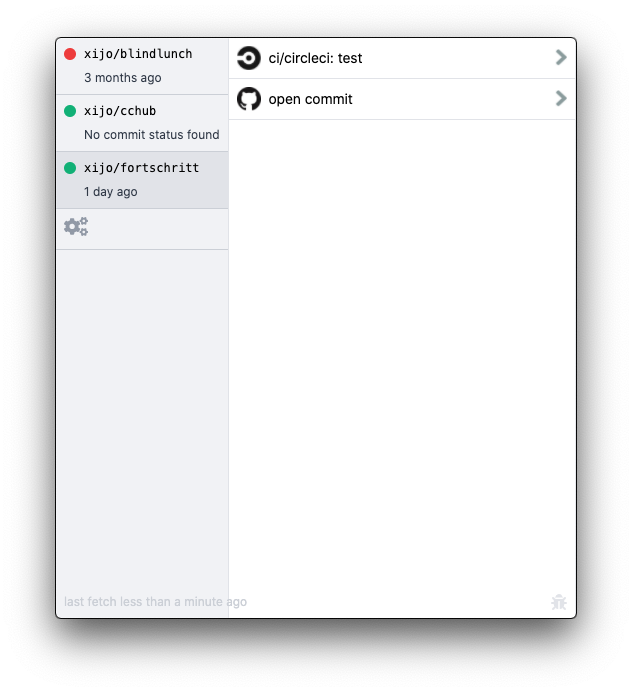
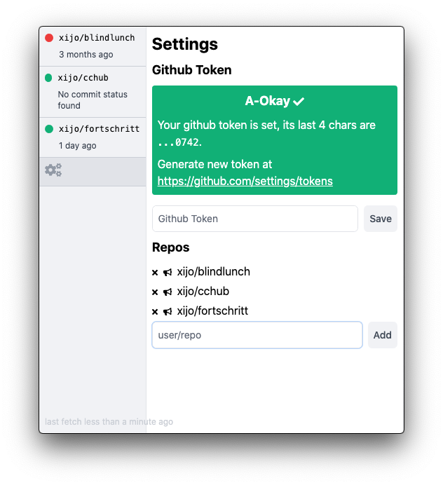

# cchub

A github commit status monitor (for mac os, for now).

## Screenshots

### Menu bar

The icon color switches depending on the build state


### Repo view

Quick overview to jump directly to the commit or the build action


### Settings

Easy to add more repos or silence builds


## Install

```bash
brew tap xijo/casks
brew install cchub
```

## Starting Development

Start the app in the `dev` environment:

```bash
yarn start
```

## Packaging for Production

To package apps for the local platform:

```bash
yarn postinstall && yarn build && yarn electron-builder --publish always --mac
sha256sum release/cchub-VERSION.dmg
```

Then update the brew cask at https://github.com/xijo/homebrew-casks
